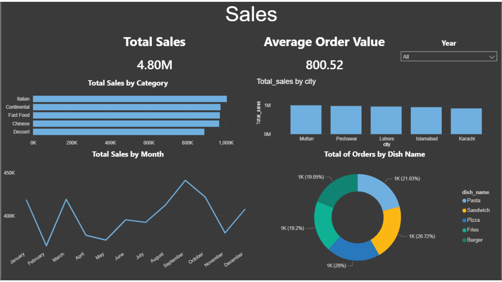
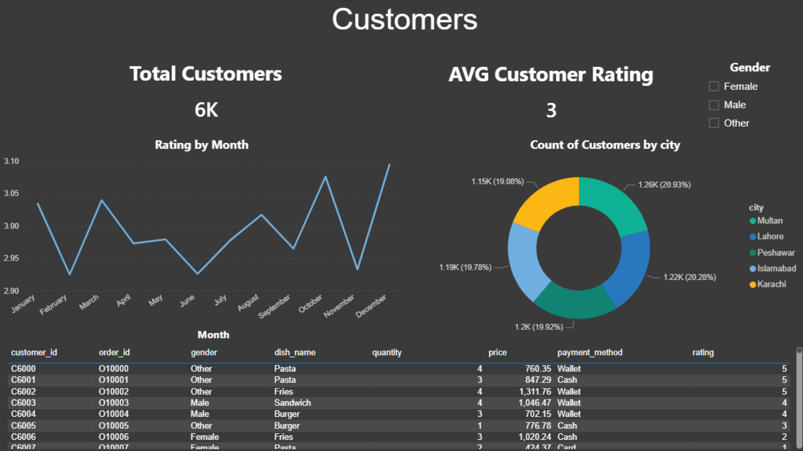
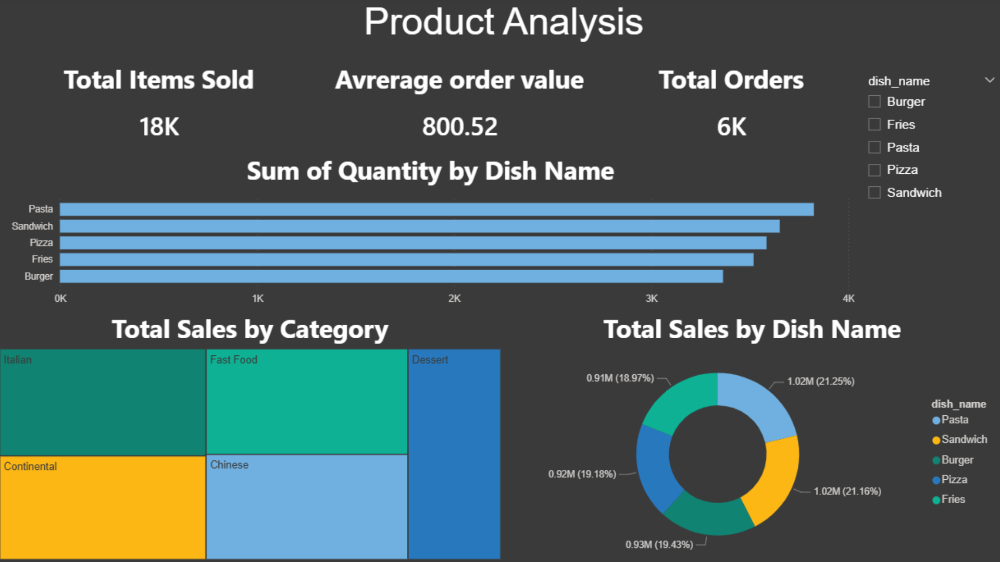

# 🍽️ Restaurant Sales & Customer Analytics Dashboard (Power BI)

## 📌 Project Overview
This project is an interactive **Restaurant Sales & Customer Analytics Dashboard** built using **Power BI**.
It helps analyze restaurant performance by tracking sales trends, customer behavior, product performance, and customer ratings.

## 🎯 Key Objectives
- Monitor total sales and total orders
- Track average order value (AOV)
- Analyze customer distribution by city and gender
- Measure customer rating trends across months
- Identify top-selling dishes and categories

## 🛠 Tools Used
- Power BI (Data Modeling, DAX, Visualizations)
- Excel Dataset

## 📊 Dashboard Pages

### 1) Sales Dashboard
- Total Sales
- Average Order Value
- Sales by Category
- Sales by City
- Monthly Sales Trend
- Orders by Dish Name

---

### 2) Customers Dashboard
- Total Customers
- Average Customer Rating
- Rating Trend by Month
- Customer Distribution by City
- Gender Filtering

---

### 3) Product Analysis Dashboard
- Total Items Sold
- Average Order Value
- Total Orders
- Quantity by Dish Name
- Total Sales by Category
- Total Sales by Dish Name

---

## 🚀 Insights
- Customer rating is stable across months with slight fluctuations.
- Some dishes generate high quantity sales consistently.
- Sales distribution differs significantly by city.
- Category analysis helps identify the best-performing food types.

## 👤 Author
**Nour Eldeen**  
🔗 GitHub: https://github.com/Nour200613  
🔗 LinkedIn: www.linkedin.com/in/nour7
